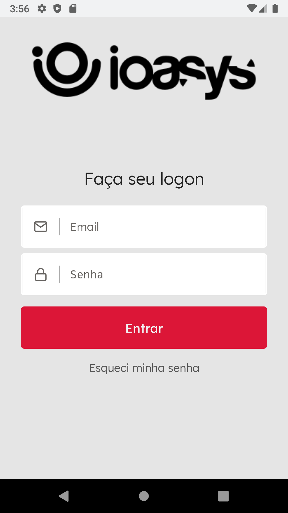
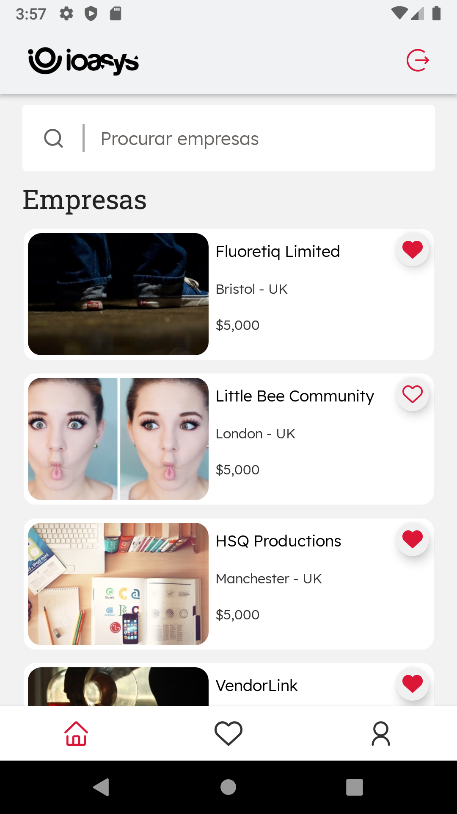
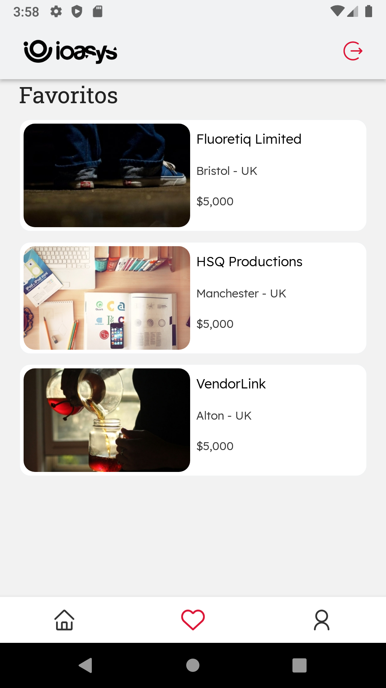
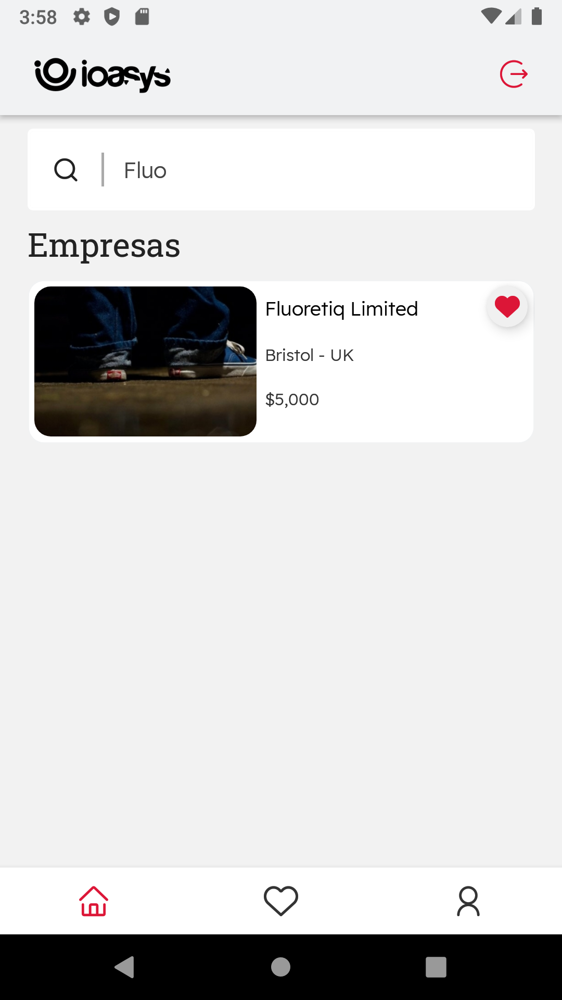
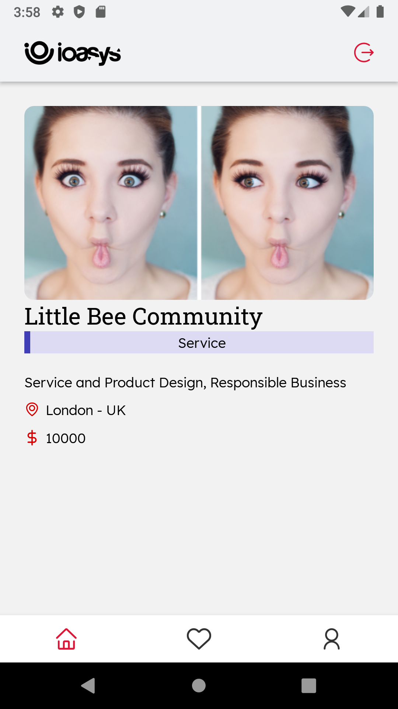
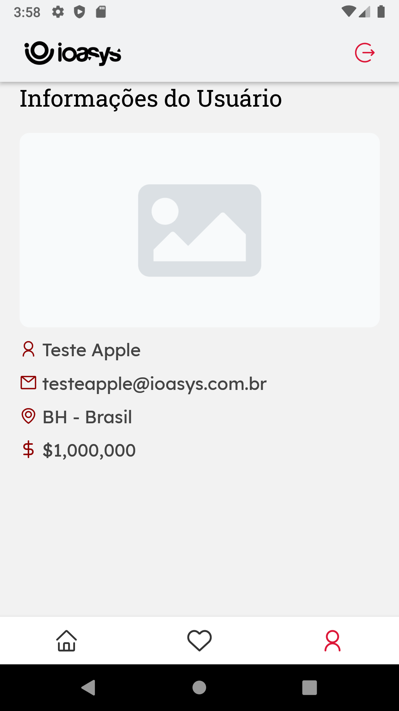

<h3 align="center">
    
    <br><br>
    <br>
</h3>

<p align="center"> 
  <a href="https://github.com/adlerke/enterprisesioasys/commits/master">
    
  </a>
  
   <a href="https://github.com/adlerke/enterprisesioasys/stargazers">
    
  </a>

</p>


## ℹ️ Sobre

### Objetivo ###

* Desenvolver uma aplicação React Native que consuma a API `Empresas`, cujo Postman esta compartilhado neste repositório (collection) -  ReadmAssets/App_Empresas.postman_collection.

### O que será avaliado?
* A ideia com este teste é ter um melhor entendimento das suas habilidades com Javascript e React Native. Mas de qualquer forma, um layout bonito e com boa usabilidade é **MUITO** bem vindo.
- A qualidade e desempenho do seu código
- Sua capacidade de organizar o código
- Capacidade de tomar decisões

### Escopo do Projeto
* O Login e acesso de Usuário já registrados
	* Para o login usamos padrões OAuth 2.0. Na resposta de sucesso do login a api retornará 3 custom headers:
		* `access-token`;
		* `client`;
		* `uid`;
	* Para ter acesso às demais APIs precisamos enviar esses 3 (três) custom headers para a API autorizar a requisição;
* Endpoints disponíveis:
	* Listagem de Empresas: `/enterprises`
	* Detalhamento de Empresas: `/enterprises/{id}`
	* Filtro de Empresas por nome e tipo: `/enterprises?enterprise_types={type}&name={name}`
* Gostaríamos que todos os três endpoints disponibilizados fossem utilizados.

### Dados para Teste ###
* Servidor: http://empresas.ioasys.com.br
* Versão da API: v1
* Usuário de Teste: testeapple@ioasys.com.br
* Senha de Teste : 12341234

## 🎨 Telas

Os usuários tem acesso ao aplicativo onde poderão navegar entre 5 páginas.
<ul>
  <li><b>Login</b> - Onde o usuário a partir do seu Email e Senha pode ter acesso as páginas do App.</li> 
  <li><b>Home</b> - Que contém a lista completa de empresas e um input onde o usuário pode pesquisar uma empresa específica.</li> 
  <li><b>Favoritos</b> - Que contém a lista de empresas marcadas como favoritas na pagina Home</li> 
  <li><b>Detalhes</b> - A partir da pagina Home ou Favoritos o usuário pode entrar na pagina de detalhes que mostra as informações de uma empresa em específico</li> 
  <li><b>Account</b> - Que contém as informações do usuário logado</li>
</ul>


<h3 align="center">
    
    
      <br><br>
    
    
      <br><br>
    
    
      <br><br>
</h3>


## 🛠 Construído com

This project was developed with the following technologies:

-   [React](https://pt-br.reactjs.org/)
-   [React Native](https://reactnative.dev/)
-   [Typescript](https://www.typescriptlang.org/) 
-   [React Navigation](https://reactnavigation.org/) - Para trabalhar com rotas
-   [Axios](https://www.npmjs.com/package/axios) - Para trabalhar com requisições HTTP
-   [Styled Components](https://styled-components.com/) - Para usar a sintaxe do CSS3 ao invés do CSS-in-JS
-   [ESLint](https://eslint.org/) - Organização e padronização de código
-   [Prettier](https://prettier.io/)
-   [VS Code](https://code.visualstudio.com/)
-   [Unform](https://unform.dev/) - Biblioteca focada em desempenho que ajuda criar formulários no React com o poder do desempenho dos Uncontrolled components e dos Hooks
-   [React Native SVG](https://www.npmjs.com/package/react-native-svg) - Bilblioteca para trabalhar com SVG no React Native, exemplo na tela de Favoritos(sem nenhum favorito)
-   [React Native Vector Icons](https://www.npmjs.com/package/react-native-vector-icons) - Biblioteca para trabalhar com ícones no React Native 
-   [React Number Format](https://www.npmjs.com/package/react-number-format) - Formatação de Números - alternativa ao intl - Data, Currency etc.
-   [Yup](https://www.npmjs.com/package/yup) - Validação de formulários no Front-end feita de maneira simples.


## 🚀 Como iniciar

```bash
# Clone o repositório
$ git clone https://github.com/adlerke/enterprisesioasys

# Acesse a pasta
$ cd enterprisesioasys

# Instale as dependencias
$ yarn

# Inicie o AVD Android ou Emulador iOS
-
# Inicie a aplicação
$ yarn android
#or yarn ios
```

## 📝 Entre em contato


<a href="https://twitter.com/adlerkes" target="_blank" >
    
</a>
  <a href="https://www.linkedin.com/in/adler-kesley-34b09511b/" target="_blank" >
  
</a>
<p>With 💙 by <a href="https://instagram.com/_adlerk" target="_blank" >Adler Kesley</a>


[nodejs]: https://nodejs.org/
[expo]: https://expo.io/
[reactjs]: https://reactjs.org
[rn]: https://facebook.github.io/react-native/
[yarn]: https://yarnpkg.com/
[vscode]: https://code.visualstudio.com/
[vceditconfig]: https://marketplace.visualstudio.com/items?itemName=EditorConfig.EditorConfig
[license]: https://opensource.org/licenses/MIT
[vceslint]: https://marketplace.visualstudio.com/items?itemName=dbaeumer.vscode-eslint
[prettier]: https://marketplace.visualstudio.com/items?itemName=esbenp.prettier-vscode
[rs]: https://rocketseat.com.br
